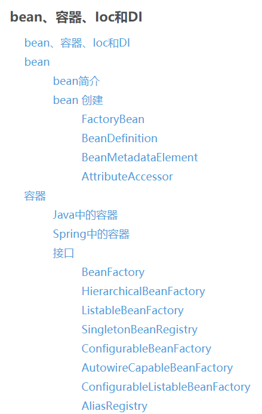
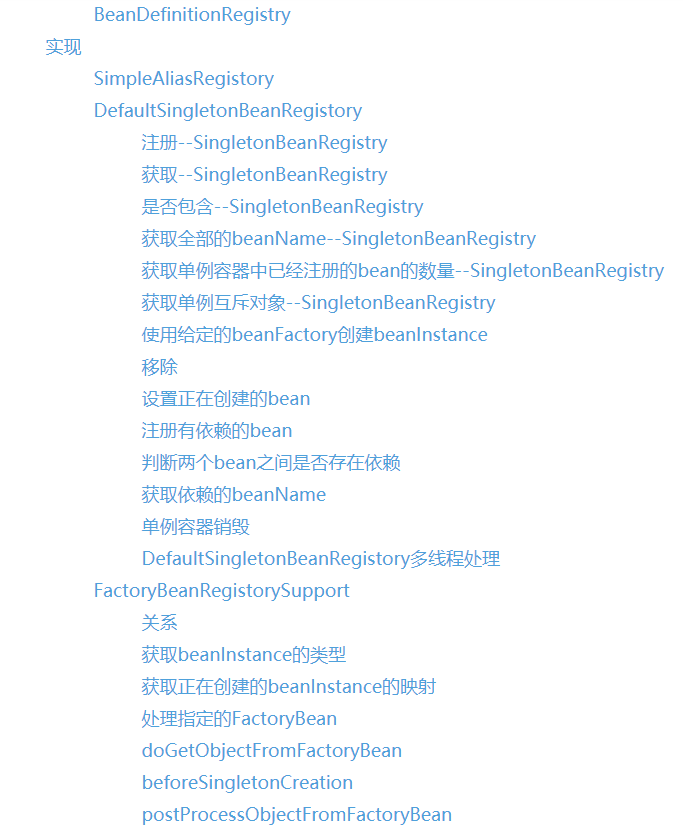
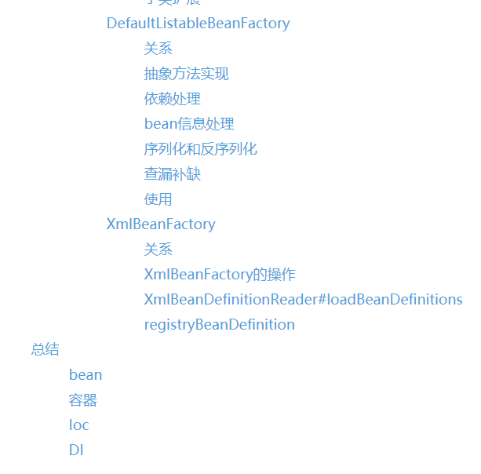

# studySpringSource
# [Spring源码--BeanFactory](https://blog.csdn.net/a18792721831/article/details/108172805)
介绍spring的基本容器。  

# [Spring源码--Bean生命周期](https://blog.csdn.net/a18792721831/article/details/108295349)
介绍bean的生命周期。  
  
# [bean、容器、Ioc和DI](https://blog.csdn.net/a18792721831/article/details/108551762)  
  
  
  
  
